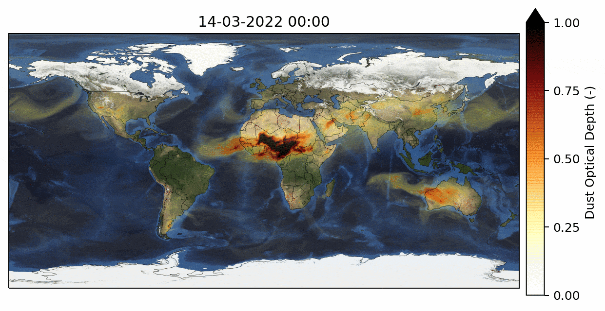
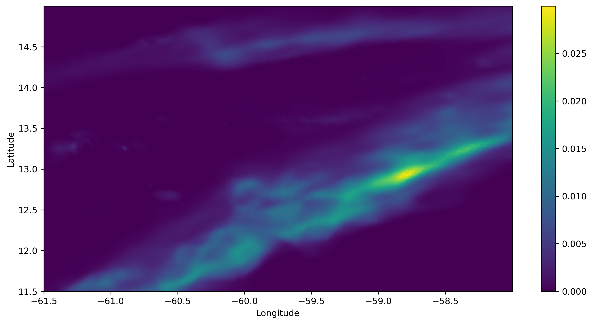

# ARTist

python library for post-processing and plotting [**<ins>ICON-ART</ins>**](https://www.imk-tro.kit.edu/english/5925.php) output.

**Aerosol and Reactive Trace gases (ART)**, as a submodule of [**<ins>ICON</ins>**](https://www.dwd.de/EN/research/weatherforecasting/num_modelling/01_num_weather_prediction_modells/icon_description.html), supplements the model by including emissions, transport, gas phase chemistry, and aerosol dynamics in the troposphere and stratosphere. ART is being developed and maintained at [**<ins>Karlsruhe Institute of Technology (KIT) Germany</ins>**](https://www.imk-tro.kit.edu/english/3487.php).



## Installation

### Install using pip:

```bash
pip install icon-artist
```
or

```bash
pip install git+https://github.com/pankajkarman/ARTist.git
```

#### Dependencies

1. Plotting requires [cartopy](https://anaconda.org/conda-forge/cartopy).

2. This library is an extension of [xarray](https://anaconda.org/conda-forge/xarray) for analysing ICON-ART output.

## Documentation

Latest documentation is available [here](https://pankajkarman.github.io/ArtViz/).


## Usage

`ARTist` is easy to use. Just import using:

```python
import xarray as xr
import artist
```

And get going.

```python
ds = xr.open_dataset(filename)
da = ds['ash_mixed_acc']
```
Plot using native traingular grids:

```python
fig, ax = plt.subplots(1, 1, figsize=(12, 6))
da.icon.tri_plot(gridfile, ax)
```


Regrid to Rectangular Grids and plot:

```python
dz = da.icon.regrid(g, lon_vec, lat_vec, method='linear')
dz.plot()
```



