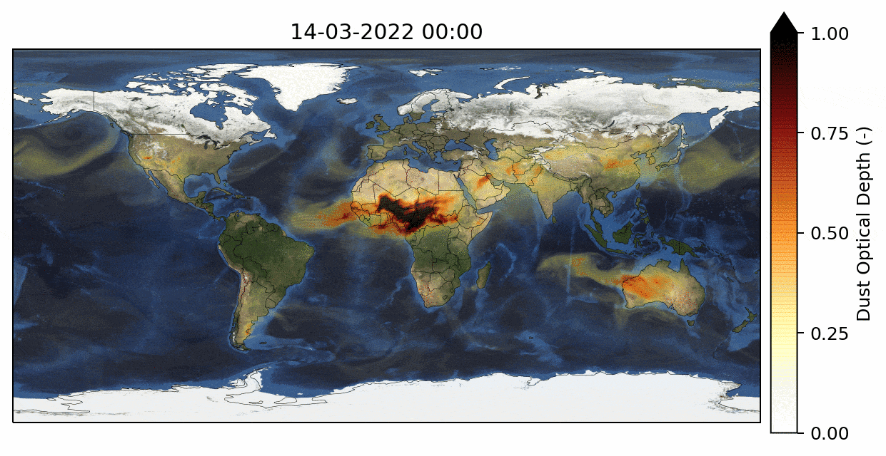
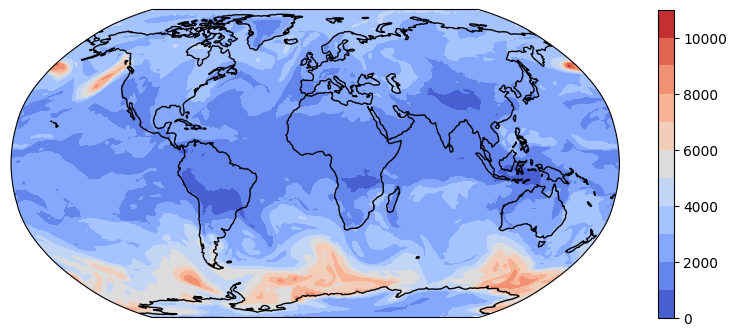
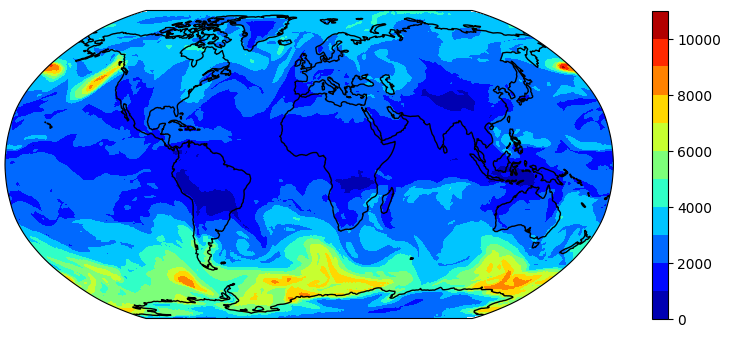
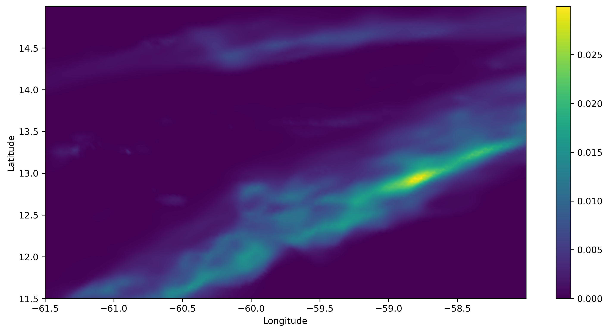
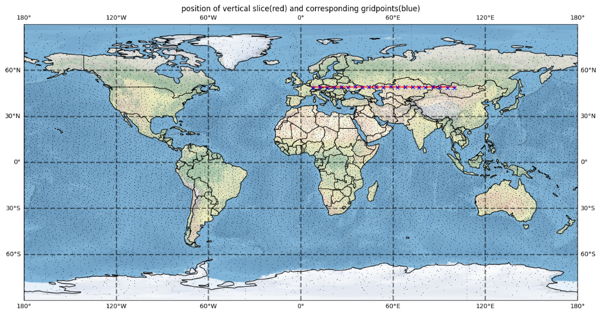

# ARTist

ARTist is an xarray-native Python toolkit for post-processing, diagnosing, and
plotting [ICON-ART](https://www.imk-tro.kit.edu/english/5925.php) model output.
It adds convenient accessors to xarray `Dataset` and `DataArray` objects for
working with native ICON grids, regridding fields, visualizing triangular-cell
data, and calculating ART tracer and plume diagnostics.

**Aerosol and Reactive Trace gases (ART)** is a submodule of
[ICON](https://www.dwd.de/EN/research/weatherforecasting/num_modelling/01_num_weather_prediction_modells/icon_description.html)
for emissions, transport, gas-phase chemistry, and aerosol dynamics in the
troposphere and stratosphere.



## Installation

Install from PyPI:

```bash
pip install icon-artist
```

or from GitHub:

```bash
pip install git+https://github.com/pankajkarman/ARTist.git
```

Plotting utilities require [Cartopy](https://scitools.org.uk/cartopy/docs/latest/).
With conda, Cartopy is usually easiest to install from conda-forge:

```bash
conda install -c conda-forge cartopy
```

## Documentation

Latest documentation is available at: https://pankajkarman.github.io/ARTist/

## Quick Start

```python
import xarray as xr
import artist

ds = xr.open_dataset("icon_art_output.nc")
ds.icon.add_grid("icon_grid.nc")

da = ds["ash_mixed_acc"]
```

## Accessors

ARTist currently registers these accessors:

- `ds.icon`: dataset-level ICON grid helpers
- `da.icon`: DataArray-level native-grid helpers
- `ds.art`: dataset-level ART optical diagnostics
- `da.art`: ART tracer diagnostics
- `da.viz`: lightweight plotting helper for arrays with `clon`/`clat`

## ICON Grid Helpers

Attach grid coordinates and find native cells nearest to lon/lat points:

```python
ds.icon.add_grid("icon_grid.nc")

points = [[13.0, 52.0], [14.0, 53.0]]
gridpoints = ds.icon.nearest_gridpoints(points)
```

Compute vertical layer thickness:

```python
dz = ds.icon.get_dz()
```

Find variables by name:

```python
ash_variables = ds.icon.look_up("ash")
```
## Quick plot

```python
ax = da.art.quick_plot(gridfile="icon_grid.nc")
```



## Native-Grid Plotting

Plot data directly on ICON triangular cells:

```python
import matplotlib.pyplot as plt
import cartopy.crs as ccrs

projection = ccrs.Robinson()
fig, ax = plt.subplots(1, 1, figsize=(10, 4), subplot_kw={'projection': projection})
da.viz.tricontourf(ax=ax, projection=projection, cmap='jet')
```



## Regridding

Interpolate a native ICON field to a regular lon/lat grid:

```python
import numpy as np

lon = np.linspace(0, 20, 101)
lat = np.linspace(40, 60, 81)

regular = da.icon.regrid("icon_grid.nc", lon, lat, method="linear")
regular.plot()
```



Plot a vertical slice line:

```python
ax = ds.icon.show_slice_line(points, gridpoints)
```


## ART Tracer Diagnostics

Column tracer load:

```python
load = da.art.tracer_load(ds["rho"], dz)
```

Select plume cells:

```python
plume = da.art.select_plume(1e-9)
```

Plume height diagnostics:

```python
top = plume.art.plume_top(ds["z_mc"])
bottom = plume.art.plume_bottom(ds["z_mc"])
max_height = plume.art.max_conc_height(ds["z_mc"])
```

Plume center:

```python
center = plume.art.plume_center(
    ds["cell_volume"],
    ds["z_mc"],
    dim=("height", "ncells"),
)
```

Value at plume top:

```python
temp_at_top = plume.art.value_at_plume_top(ds["z_mc"], ds["temp"])
```

## ART Optical Diagnostics

Compute optical forward-operator diagnostics from a full ICON-ART dataset:

```python
alpha, beta = ds.art.rayleigh_part(532)
attenuated = ds.art.att_bsct(532)
spherical_attenuated = ds.art.att_bsct_sph(532)
```

Compute layer and column aerosol optical depth:

```python
layer_aod = ds.art.aod(532)
column_aod = layer_aod.sum("height")
accumulation_aod = ds.art.aod_misr(532, frac="acc")
```

Compute single-scattering albedo:

```python
single_scattering_albedo = ds.art.ssa(532)
```
